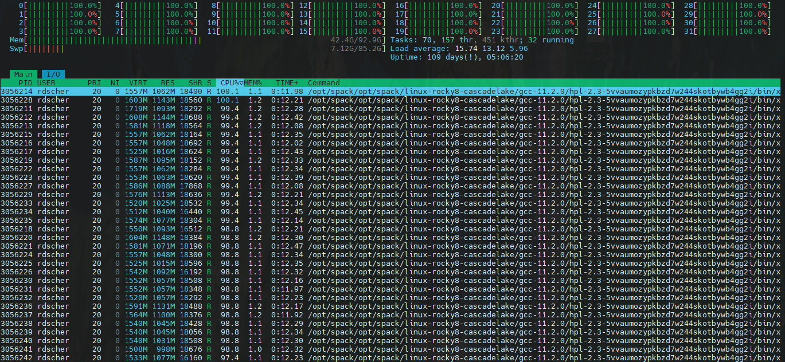

# Checking on running jobs

### Viewing your job in the queue:
If you would like to check the status of your job, you can use the `qstat` command to do so. Typing `qstat` without any options will output all currently running or queued jobs to your terminal window, but there are many options to help display relevant information. To find more of these options type `man qstat` when logged in to a CARC machine. To see which jobs are running and queued in the standard output type the following in a terminal window:

CARC clusters use slurm for job resource management. Slurm has a Queue system for determining who gets to use resources at what time. You can check the slurm queue with the `squeue` command. This will show you all jobs that are currently submitted to the slurm queue on your cluster. (Note, each cluster will have their own individual queue).

    [rdscher@hopper ~]$ squeue
    JOBID PARTITION     NAME     USER ST       TIME  NODES NODELIST(REASON)
    2562894     condo 216-5.05   lzhang  R 1-05:45:57      1 hopper015
    2462342     debug ethylben   eattah PD       0:00      8 (PartitionNodeLimit)
    2563197     debug jupyterh  ejoseph  R      38:46      1 hopper011
    2562985   general test2.sl dctorney  R   11:40:32      2 hopper[003,005]
    2563194   general   run.sh  ejoseph  R    3:46:13      1 hopper001
    2561221   general       rf   lzhang  R   10:30:06      1 hopper006
    2561222   general       rf   lzhang  R   10:30:06      1 hopper007
    2563029    geodef jupyterh zacharys  R    8:43:01      1 hopper065

While this can be helpful, there are often so many jobs in the queue it is hard to find the information you're looking for. We can use a variety of differnet flags to help parse this data for the information we want. 

1) `squeue --me` - show only your jobs in the queue
2) `squeue -p debug` - show all jobs in the debug partition (You can replace this with any partition)
3) `squeue -S PD` - show all jobs in the pending (PD) state.

Note there are many other flags you can pass, use `man squeue` to read more. Note also that you can use any combination of the above flags to further narrow down on the information you are looking for. 

You can also use the `watch squeue --me` command. This will use your terminal to run the `squeue --me` command every 2 seconds by default, that way you can watch your job as it runs and know as soon as it completes.

### Viewing other information about your job:

`sacct` has multiple different ways to check information about your job after it's completed as long as you have the job id. For example, you can check general information with `sacct -j <JOB_ID>`. If you enter just `sacct` it will give you the information for your most recently ran job.

    [rdscher@hopper ~]$ sacct -j 2563198
    JobID           JobName  Partition    Account  AllocCPUS      State ExitCode
    ------------ ---------- ---------- ---------- ---------- ---------- --------
    2563198            bash      debug    2016365          1     FAILED      2:0
    2563198.ext+     extern               2016365          1  COMPLETED      0:0
    2563198.0          bash               2016365          1     FAILED      2:0

You can view the other flags that can be passed to sacct with `man sacct`.

You can view more information about your job, including what resources were used, using scontrol. For example;

    [rdscher@hopper ~]$ scontrol show job 2563198
    JobId=2563198 JobName=bash
    UserId=rdscher(3792) GroupId=users(100) MCS_label=N/A
    Priority=10526 Nice=0 Account=2016365 QOS=normal
    JobState=FAILED Reason=NonZeroExitCode Dependency=(null)
    Requeue=1 Restarts=0 BatchFlag=0 Reboot=0 ExitCode=130:0
    RunTime=00:02:01 TimeLimit=04:00:00 TimeMin=N/A
    SubmitTime=2024-06-10T22:40:02 EligibleTime=2024-06-10T22:40:02
    AccrueTime=Unknown
    StartTime=2024-06-10T22:40:02 EndTime=2024-06-10T22:42:03 Deadline=N/A
    PreemptEligibleTime=2024-06-10T22:40:02 PreemptTime=None
    SuspendTime=None SecsPreSuspend=0 LastSchedEval=2024-06-10T22:40:02 Scheduler=Main
    Partition=debug AllocNode:Sid=hopper:433043
    ReqNodeList=(null) ExcNodeList=(null)
    NodeList=hopper011
    BatchHost=hopper011
    NumNodes=1 NumCPUs=1 NumTasks=1 CPUs/Task=1 ReqB:S:C:T=0:0:*:*
    ReqTRES=cpu=1,mem=2938M,node=1,billing=1
    AllocTRES=cpu=1,mem=2938M,node=1,billing=1
    Socks/Node=* NtasksPerN:B:S:C=0:0:*:* CoreSpec=*
    MinCPUsNode=1 MinMemoryCPU=2938M MinTmpDiskNode=0
    Features=(null) DelayBoot=00:00:00
    OverSubscribe=OK Contiguous=0 Licenses=(null) Network=(null)
    Command=bash
    WorkDir=/users/rdscher
    Power=

More information about scontrol flags can be found with `man scontrol`.

### Interactively watching your jobs:

If you would like to verify your job is running as expected, you can start by checking `squeue` after your job starts to run;

    [rdscher@hopper gcc-11]$ squeue --me
    JOBID PARTITION     NAME     USER ST       TIME  NODES NODELIST(REASON)
    2563200   general hpl.slur  rdscher  R       0:27      1 hopper002

Here, we can see that my job is currently in the `R` (Running) state, and I now can see the specific node it is running on (hopper002). While my job is running, I will be able to ssh into the node using `ssh hopper002`. Keep in mind you can only ssh into a compute node whilst your job is currently running on that specific node. 

Once on the node, I can use a variety of differnet commands to see if my job is running properly. For example, one thing I can do is run the `htop` command, and see if I am utilizing all the resources I requested. In this example, I requested

    #SBATCH --nodes 1
    #SBATCH --ntasks 32

This means I should be utilizing all 32 cores on the compute node. When I ssh into the compute node I can tell my program is working properly because all of the resources are being used;

If I were to check this screen and not see many of the resources being used, that would be a good sign that I need to either verify my program is running properly, or reduce the number of resources I'm requesting for this particular job.

If you are running a program on gpus and would like to verify everything is running there, you can use the `nvidia-smi` command;

    [rdscher@hopper054 gcc-11]$ nvidia-smi
    Mon Jun 10 22:57:28 2024
    +---------------------------------------------------------------------------------------+
    | NVIDIA-SMI 545.23.08              Driver Version: 545.23.08    CUDA Version: 12.3     |
    |-----------------------------------------+----------------------+----------------------+
    | GPU  Name                 Persistence-M | Bus-Id        Disp.A | Volatile Uncorr. ECC |
    | Fan  Temp   Perf          Pwr:Usage/Cap |         Memory-Usage | GPU-Util  Compute M. |
    |                                         |                      |               MIG M. |
    |=========================================+======================+======================|
    |   0  NVIDIA A100-PCIE-40GB          On  | 00000000:D8:00.0 Off |                    0 |
    | N/A   14C    P0              30W / 250W |      4MiB / 40960MiB |      0%      Default |
    |                                         |                      |             Disabled |
    +-----------------------------------------+----------------------+----------------------+

    +---------------------------------------------------------------------------------------+
    | Processes:                                                                            |
    |  GPU   GI   CI        PID   Type   Process name                            GPU Memory |
    |        ID   ID                                                             Usage      |
    |=======================================================================================|
    |  No running processes found                                                           |
    +---------------------------------------------------------------------------------------+

This will show all gpus you're able to see, as well as other information like the amount of memory you're using the gpu. Running processes would show up at the bottom here as well. 

Note that you will only see anything from the `nvidia-smi` command at all if you both on a node that has a gpu, and have requested that gpu through slurm on your specific job. 

In the case that a node as multiple gpus, you will only be able to see the ones you have access to via requesting them with slurm. 
 
### Viewing Output and Error Files:

Once your job has completed, you will see a file called slurm-<job-id>.out with all of the information pertaining to the job. 

Any output from the job sent to “standard output” will be written to the output file, if you specify to have an error file, any output sent to "standard error" will be placed in slurm-<job-id>.err in the same directory. If you do not specify an error file, it will be sent to the output file along with any other output.