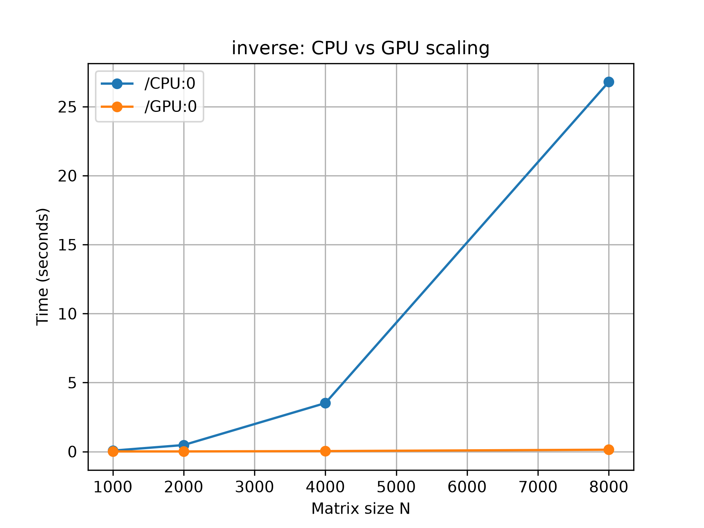
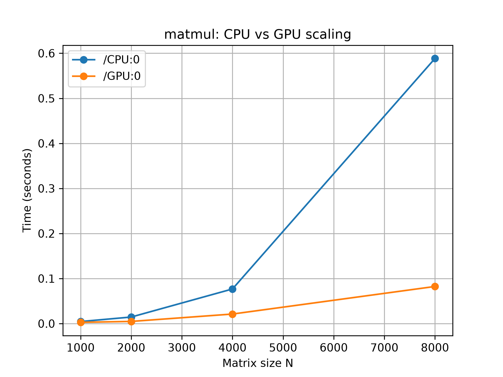

# Introduction to TensorFlow

The relatively recent mainstream availability of complex algorithms and computationally efficient hardware has created a platform for innovations never before available to the scientific computing world. Since the development of early computer systems, computing times have been drastically reduced, making more complex computations feasible. The continuous cycle of improvements in computation speed and hardware, driving ever more complex computation goals, can be seen in how hardware has scaled to meet those goals. A key part of this cycle is the use of GPUs in high-performance computing for machine learning and deep learning algorithms.

Most complex computing strategies can be simplified into basic linear algebra operations such as addition, multiplication, subtraction, and inversion. Of these, matrix multiplication and inversion are the most computationally expensive.

Most matrix operations are performed sequentially on the CPU, resulting in computation time that scales with the size of the matrix by a factor of &theta;(n<sup>3</sup>). As a result, the time required for computation is proportional to matrix size, constrained further by limited cache memory and RAM. This same problem persists with multicore or distributed systems due to those same resource thresholds. A GPU, on the other hand, is composed of several thousand cores, providing several GBs of computational memory compared to the MBs available in CPU cache. This configuration enables parallelism across GPU cores and a much higher data bandwidth, massively reducing computation time as the device scales its performance with data size.

These gains in computation time give researchers good reason to move computationally heavy operations from CPUs to GPUs, particularly where CPU-based operations don't scale with data at a constant rate. This benefits computationally heavy domains such as machine learning, deep learning, linear algebra, optimization, and data structures broadly.

### CARC Benchmarks

To illustrate the CPU-vs-GPU performance gap, here are benchmarks run on Easley's `l40s` partition (a single NVIDIA L40S GPU), comparing CPU-only execution against GPU-accelerated execution for matrix multiplication and matrix inversion using TensorFlow at increasing matrix sizes (N = 1000, 2000, 4000, 8000).



Fig 1. Time for matrix inversion vs. size of matrix N



Fig 2. Time for matrix multiplication vs. size of matrix N

Both operations scale far better on the GPU as matrix size grows. At N=8000, matrix multiplication takes 0.59s on CPU versus 0.08s on the GPU (about 7x faster), and matrix inversion takes 26.8s on CPU versus 0.13s on the GPU (about 200x faster) — inversion in particular benefits from the GPU's parallelism since its computational cost grows faster with matrix size than multiplication's does.

### TensorFlow Basics

TensorFlow is an open-source deep learning library originally developed by Google. It provides primitives for defining functions over tensors and automatically computing their derivatives. A tensor represents any multidimensional array of numbers, similar in spirit to a NumPy array.

**Comparing NumPy and TensorFlow**

Both libraries store data in N-dimensional arrays — NumPy's `ndarray` and TensorFlow's `tf.Tensor`. However, NumPy doesn't support automatic differentiation or GPU acceleration. For workloads that need either of those — like training neural networks — TensorFlow's GPU support and built-in autograd typically make it the better choice, especially as data dimensionality grows.

**NumPy vs. TensorFlow: Matrix Addition**

***NumPy:***
```python
import numpy as np

a = np.zeros((2, 2))
b = np.zeros((2, 2))
np.sum(b, axis=0)
a.shape
np.reshape(b, (1, 4))
```

***TensorFlow (2.x, eager execution):***
```python
import tensorflow as tf

a = tf.zeros((2, 2))
b = tf.ones((2, 2))
tf.reduce_sum(b, axis=1)
a.shape
tf.reshape(b, (1, 4))
```

Unlike older versions of TensorFlow, TensorFlow 2.x uses **eager execution** by default — operations run and return values immediately, just like NumPy, with no separate "session" step required.

For example, in NumPy:
```python
a = np.zeros((2, 2))
print(a)
```
This immediately prints the value of `a`. In modern TensorFlow, the same is true:
```python
a = tf.zeros((2, 2))
print(a)
```
This also prints the value of `a` right away — no `.eval()` or session needed. (Older TensorFlow 1.x code required wrapping everything in a `tf.Session()` and explicitly calling `.eval()` or `sess.run()` to get a value; that pattern is obsolete in TensorFlow 2.x.)

**TensorFlow Variables**

Like other programming languages, TensorFlow uses a `Variable` object to store and update parameters that change during training (e.g. model weights). In TensorFlow 2.x, variables are initialized immediately when created — no separate initialization step is needed:

```python
import tensorflow as tf

W = tf.Variable(tf.zeros((2, 2)), name="weights")
R = tf.Variable(tf.random.normal((2, 2)), name="random_weights")

print(W)
print(R)
```

**Converting NumPy Data to a Tensor**

```python
import numpy as np
import tensorflow as tf

a = np.zeros((3, 3))
t_a = tf.convert_to_tensor(a)
print(t_a)
```

**Functions and Custom Operations**

Older TensorFlow code used `tf.placeholder` to define inputs that were filled in later via a `feed_dict`. In TensorFlow 2.x, you simply write a regular Python function — optionally decorated with `@tf.function` for performance — and call it directly with your data:

```python
import tensorflow as tf

@tf.function
def multiply(input1, input2):
    return tf.multiply(input1, input2)

result = multiply(7.0, 2.0)
print(result)
```

This replaces the old pattern of defining `tf.placeholder` variables and feeding them through a `tf.Session()`.

### Learning More TensorFlow

Rather than reproduce a full general-purpose TensorFlow walkthrough here, we recommend going straight to the source: the [official TensorFlow tutorials](https://www.tensorflow.org/tutorials) maintained by Google. These are kept up to date with the current TensorFlow API and run as ready-to-use Jupyter/Colab notebooks with no local setup required.

A good starting point is the [TensorFlow 2 quickstart for beginners](https://www.tensorflow.org/tutorials/quickstart/beginner), which walks through loading a dataset, building a simple Keras model, and training/evaluating it. For a deeper, lower-level walkthrough, the [quickstart for experts](https://www.tensorflow.org/tutorials/quickstart/advanced) covers the same task using TensorFlow's more customizable API.

> **Note:** if you've used TensorFlow before and your code still uses `tf.Session()`, `tf.placeholder`, or `tf.initialize_all_variables()` — that's the TensorFlow 1.x API, fully superseded by eager execution in TensorFlow 2.x. See Google's [Effective TensorFlow 2](https://www.tensorflow.org/guide/effective_tf2) guide and the official [migration guide](https://www.tensorflow.org/guide/migrate) if you need to update older code.

*This quickbyte was validated on 6/22/2026*
